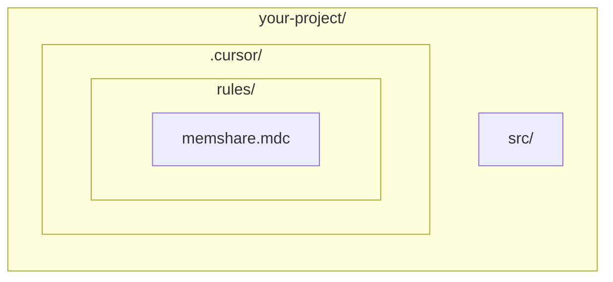

# memShare Adapter: Cursor

> Integrate memShare with [Cursor](https://cursor.sh) IDE.

---

## Setup

### Method 1: Project Rules (Recommended)

1. Create `.cursor/rules/memshare.mdc` in your project root
2. Use the same rule content as in `codebuddy.md` adapter
3. Update `MEMSHARE_DATA_DIR` to your data directory

### Method 2: Global Rules

1. Open Cursor Settings → Rules
2. Add the memShare rule content to your global rules
3. This applies to all projects

## Cursor-Specific Notes

- Cursor uses `.cursor/rules/` directory for project rules
- Rule files use `.mdc` extension with YAML frontmatter
- Set `alwaysApply: true` to load the memory system on every session

## File Structure

## Tips

- Cursor's Composer mode works well with memory-aware prompts
- Use `@file` to reference specific memory files when needed
- The memory system works best when you let the agent write memories after each session
