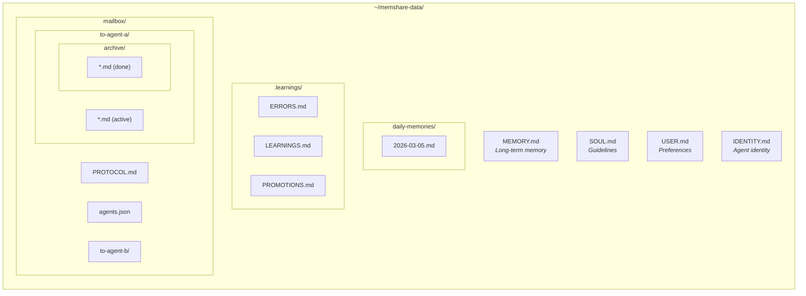

# memShare Adapter: Generic (Any AI Tool)

> This adapter provides instructions for integrating memShare with any AI coding assistant.

---

## Core Concept

memShare works by injecting a set of rules into your AI agent's system prompt.
These rules instruct the agent to:

1. **Read** memory files at session start
2. **Write** daily records after completing work
3. **Track** errors and learnings for self-improvement
4. **Communicate** with other agents via mailbox

## Integration Methods

### Method A: System Prompt Injection

If your AI tool supports custom system prompts:
1. Copy the rule content from `codebuddy.md` adapter
2. Add it to your system prompt
3. Update file paths to match your setup

### Method B: Project Rules File

If your AI tool supports project-level rule files:
1. Create a rules file in the appropriate directory
2. Use the rule content from `codebuddy.md` adapter

### Method C: MCP Server

If your AI tool supports MCP (Model Context Protocol):
1. Use the MCP server provided in `mcp_server.py`
2. Configure it in your tool's MCP settings
3. See `claude-desktop.md` for MCP configuration example

### Method D: Manual Reference

If none of the above work:
1. At session start, ask the agent to read memory files
2. At session end, ask the agent to write a summary
3. Use the templates in `templates/` directory

## Required Capabilities

Your AI tool must support at least one of:
- [ ] File reading (to load memories)
- [ ] File writing (to save memories)
- [ ] Custom system prompts (for rule injection)
- [ ] MCP protocol (for tool integration)

## File Paths

Default data directory: `~/memshare-data`

