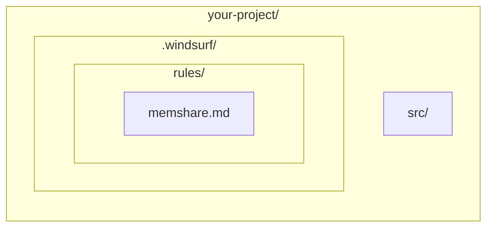

# memShare Adapter: Windsurf (Codeium)

> Integrate memShare with [Windsurf](https://codeium.com/windsurf) IDE.

---

## Setup

### Project Rules

1. Create `.windsurf/rules/memshare.md` in your project root
2. Use the same rule content as in `codebuddy.md` adapter
3. Update `MEMSHARE_DATA_DIR` to your data directory

### Global Rules

1. Open Windsurf Settings → AI → Rules
2. Add the memShare rule content
3. This applies to all projects

## File Structure

## Windsurf-Specific Notes

- Windsurf's Cascade mode supports multi-step workflows — ideal for memory read/write
- Use the memory system to maintain context across Cascade sessions
- Windsurf supports file reading tools that can access memory files directly
