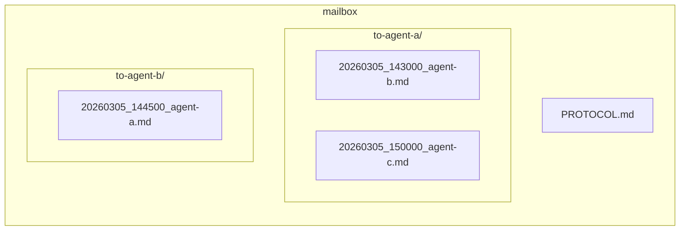
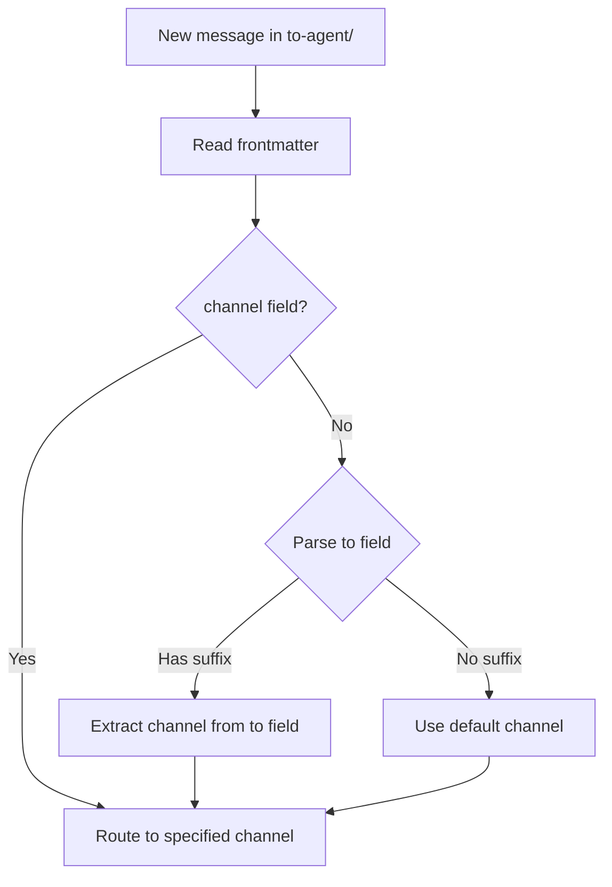

# Mailbox Protocol

> Cross-agent communication protocol for memShare.
> Enables different AI agents to exchange messages asynchronously.

---

## Directory Structure



## Message Format

Each message is a Markdown file with YAML frontmatter:

```markdown
---
from: agent-b
to: agent-a
timestamp: "2026-03-05T14:30:00+08:00"
type: message          # message | request | response | notification
status: unread         # unread | read | done
---

## Subject

Message content here.
```

## File Naming

```
{YYYYMMDD}_{HHMMSS}_{from-agent-name}.md
```

Example: `20260305_143000_codebuddy.md`

## Status Lifecycle

```
unread → read → done
```

- **unread**: Newly received, not yet processed
- **read**: Acknowledged, may require action
- **done**: Fully processed, no further action needed

## Message Types

| Type | Description |
|------|-------------|
| message | General communication |
| request | Asks the recipient to perform an action |
| response | Reply to a previous request |
| notification | Informational, no action required |

## Usage Rules

1. **Write to recipient's inbox**: Always write to `to-{recipient}/` directory
2. **Don't modify others' messages**: Only the recipient should change status
3. **Use descriptive subjects**: Help recipients quickly understand the message
4. **Include context**: Don't assume the recipient has your conversation history
5. **Sync regularly**: Messages are synced via the storage backend

## Sync

Messages are synced through the same storage backend as memories:
- `python sync.py push` — Push outgoing messages
- `python sync.py pull` — Pull incoming messages

For automatic sync, configure crontab:
```bash
* * * * * cd /path/to/data && python3 /path/to/sync.py pull >> /tmp/memshare-sync.log 2>&1
```

## Channel Routing

When an agent supports multiple communication channels (e.g., WeChat Work, Feishu), senders can route messages to a specific channel via the `to` field.

### Routing Rules

The `to` field supports two formats:

| Format | Example | Routing |
|--------|---------|---------|
| `{agent-id}` | `openclaw` | Default — delivered to `to-openclaw/`, agent decides which channel |
| `{agent-id}-{channel}` | `openclaw-qiwei` | Precise — delivered to `to-openclaw/`, `channel` field marks the target |

### Message Format (with channel)

```markdown
---
from: codebuddy
to: openclaw-qiwei
channel: qiwei
timestamp: "2026-03-10T17:00:00+08:00"
type: request
status: unread
---

Message body...
```

- `to: openclaw-qiwei` — file is placed in `to-openclaw/` (routed by agent-id prefix)
- `channel: qiwei` — explicit channel marker in frontmatter for watcher to identify

### Channel Registration

Channels are registered in `agents.json` under each agent's `channels` field:

```json
{
  "agents": {
    "my-agent": {
      "name": "My Agent",
      "channels": {
        "qiwei": { "name": "WeChat Work", "type": "wechat-work-bot", "default": true },
        "feishu": { "name": "Feishu", "type": "feishu-bot", "default": false }
      }
    }
  }
}
```

### Watcher Processing Flow



See `scripts/mailbox_watcher.py` for the reference implementation.
