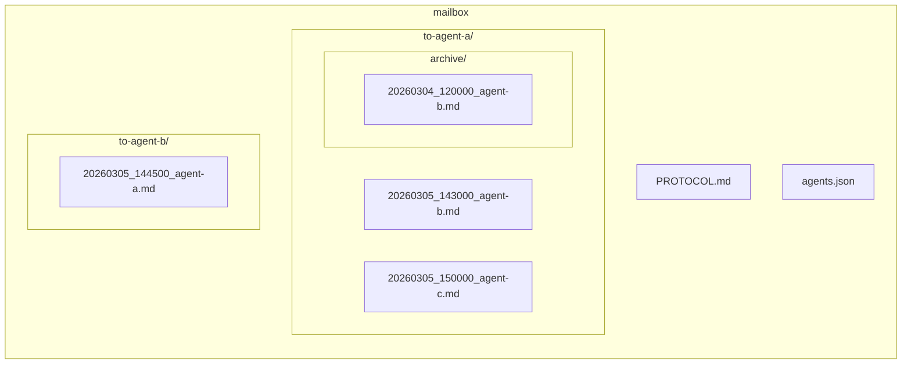
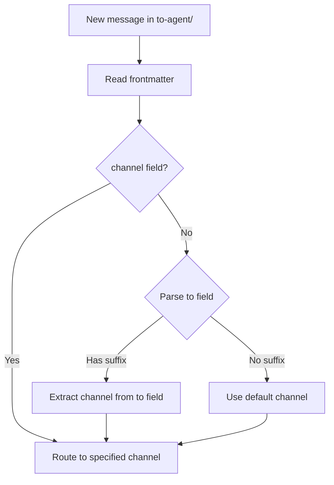

# Mailbox Protocol

> Cross-agent communication protocol for memShare.
> Enables different AI agents to exchange messages asynchronously.

---

## Directory Structure



## Agent Identity & Registration

Every agent connecting to memShare MUST register in `agents.json`:

```json
{
  "agents": {
    "codebuddy": {
      "name": "CodeBuddy",
      "type": "coding-assistant",
      "platform": "CodeBuddy (Tencent)",
      "capabilities": ["code", "file-system", "git", "mcp"],
      "mailbox": "to-codebuddy",
      "registered_at": "2026-03-05T10:00:00+08:00",
      "status": "active"
    },
    "openclaw": {
      "name": "OpenClaw",
      "type": "general-assistant",
      "platform": "WeChat Bot",
      "capabilities": ["web-search", "analysis", "document"],
      "mailbox": "to-openclaw",
      "registered_at": "2026-03-05T11:00:00+08:00",
      "status": "active"
    }
  },
  "version": 1
}
```

### Identity Rules

1. **Unique agent-id**: Each agent must have a unique lowercase identifier (e.g., `codebuddy`, `openclaw`, `cursor-work`)
2. **Registration required**: Before sending/receiving messages, the agent MUST be listed in `agents.json`
3. **From-field validation**: The `from` field in message frontmatter MUST match a registered agent-id
4. **Unknown senders**: Messages from unregistered agents should be flagged but not discarded
5. **Registration via setup**: `python setup.py` automatically registers the agent during setup

### Agent Discovery

Agents can read `agents.json` to discover available peers:
- List all registered agents and their capabilities
- Find the correct mailbox directory for a recipient
- Determine if a recipient is active

## Message Format

Each message is a Markdown file with YAML frontmatter:

```markdown
---
from: agent-b           # MUST match a registered agent-id in agents.json
to: agent-a             # MUST match a registered agent-id in agents.json
timestamp: "2026-03-05T14:30:00+08:00"
type: message           # message | request | response | notification
status: unread          # unread | read | done
---

## Subject

Message content here.
```

## File Naming

```
{YYYYMMDD}_{HHMMSS}_{from-agent-id}.md
```

Example: `20260305_143000_codebuddy.md`

## Status Lifecycle & Archiving

```
unread → read → done → [archived]
```

| Status | Meaning | Location |
|--------|---------|----------|
| **unread** | New message, not yet seen | `to-{agent}/` (inbox root) |
| **read** | Acknowledged by recipient | `to-{agent}/` (inbox root) |
| **done** | Fully processed | `to-{agent}/` → moved to `to-{agent}/archive/` |
| **archived** | In archive directory | `to-{agent}/archive/` (not scanned at startup) |

### Archive Rules

1. **When**: After setting `status: done`, the message file SHOULD be moved to `to-{agent}/archive/`
2. **Who**: The recipient agent OR the `memory_consolidator.py cleanup` cron job
3. **Why**: Keeps inbox small — agents only scan inbox root at session startup, saving context tokens
4. **Retention**: Archived messages are kept for 30 days, then auto-deleted by cleanup
5. **Scan scope**: At session startup, agents ONLY read `to-{agent}/*.md` (NOT `to-{agent}/archive/`)

### Archive Flow

```
Agent processes message
    → Set status: done
    → Move file: to-{agent}/{file}.md → to-{agent}/archive/{file}.md
    → Push sync
    → Inbox is now clean for next session
```

## Acknowledgment Rule (MANDATORY)

When an agent detects unread messages during session startup or at any check:

1. **Immediately** change every `status: unread` message to `status: read`
2. **Push** the updated files via storage backend so the sender knows their message was received
3. **Then** decide whether to reply — replies are NOT required and have no time constraint

```
Sender sends message (status: unread)
    → Recipient detects message
    → IMMEDIATELY set status: read (acknowledgment)
    → Push sync
    → (optional, async) Process and reply
    → Set status: done → move to archive/
```

## Message Types

| Type | Description |
|------|-------------|
| message | General communication |
| request | Asks the recipient to perform an action |
| response | Reply to a previous request |
| notification | Informational, no action required |

## Usage Rules

1. **Register first**: Agent must be in `agents.json` before sending/receiving
2. **Write to recipient's inbox**: Always write to `to-{recipient}/` directory
3. **Don't modify others' messages**: Only the recipient should change status
4. **Use descriptive subjects**: Help recipients quickly understand the message
5. **Include context**: Don't assume the recipient has your conversation history
6. **Sync regularly**: Messages are synced via the storage backend
7. **Acknowledge immediately**: Upon receiving a message (status=unread), MUST immediately set status to `read`
8. **Archive when done**: After processing, move message to `archive/` subdirectory

## Sync

Messages are synced through the same storage backend as memories:
- `python sync.py push` — Push outgoing messages
- `python sync.py pull` — Pull incoming messages

For automatic sync, configure crontab:
```bash
* * * * * cd /path/to/data && python3 /path/to/sync.py pull >> /tmp/memshare-sync.log 2>&1
```

## Channel Routing

When an agent supports multiple communication channels (e.g., WeChat Work, Feishu), senders can route messages to a specific channel via the `to` field.

### Routing Rules

The `to` field supports two formats:

| Format | Example | Routing |
|--------|---------|---------|
| `{agent-id}` | `openclaw` | Default — delivered to `to-openclaw/`, agent decides which channel |
| `{agent-id}-{channel}` | `openclaw-qiwei` | Precise — delivered to `to-openclaw/`, `channel` field marks the target |

### Message Format (with channel)

```markdown
---
from: codebuddy
to: openclaw-qiwei
channel: qiwei
timestamp: "2026-03-10T17:00:00+08:00"
type: request
status: unread
---

Message body...
```

- `to: openclaw-qiwei` — file is placed in `to-openclaw/` (routed by agent-id prefix)
- `channel: qiwei` — explicit channel marker in frontmatter for watcher to identify

### Channel Registration

Channels are registered in `agents.json` under each agent's `channels` field:

```json
{
  "agents": {
    "my-agent": {
      "name": "My Agent",
      "channels": {
        "qiwei": { "name": "WeChat Work", "type": "wechat-work-bot", "default": true },
        "feishu": { "name": "Feishu", "type": "feishu-bot", "default": false }
      }
    }
  }
}
```

### Watcher Processing Flow



See `scripts/mailbox_watcher.py` for the reference implementation.
